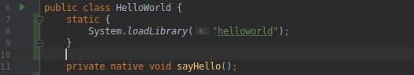
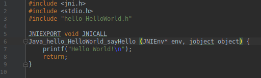

## Quick start
Create output directory:
mkdir out

Compile:
make.sh

Test different jar executable:
java -Djava.library.path=./out -jar ./out/\[JarName\].jar

## What is it ?
This sub-project is about using JNI (Java Native Interface) to create C library such as ezTrace plugins
and Java Wrapper Class

Here are three little examples : 
* hello.jar : Simple hello world in C call in Java - **Done**
* hellothread.jar \[n\] \[t\] : Creates n Java Threads which print their pthread ID every second during t seconds - **Done** 
* helloarg.jar : Call C fonctions with both primitives types and object exchange between Java & C - **Not done yet**

## Use JNI
To create hello.jar calling function from libhelloworld.so, simply specify in your Java class method's prototype with
the word 'native', and add a static block so that the JVM load the library : 

Then compile your class and generate a header file with option -h :

javac -h OUTPUT_DIR Hello.java;

Now just create your C library following the header file, and include jni.h :

Compile it as a shared library and indicates gcc where to find jni.h :

gcc -I${JAVA_HOME}/include -I${JAVA_HOME}/include/linux -shared -o libhelloworld.so hello.c

Now just compile your Java Program add option when running your app :

java -Djava.library.path=LIB_DIR -jar yourApp.jar

where LIB_DIR is the directory where you placed your .so