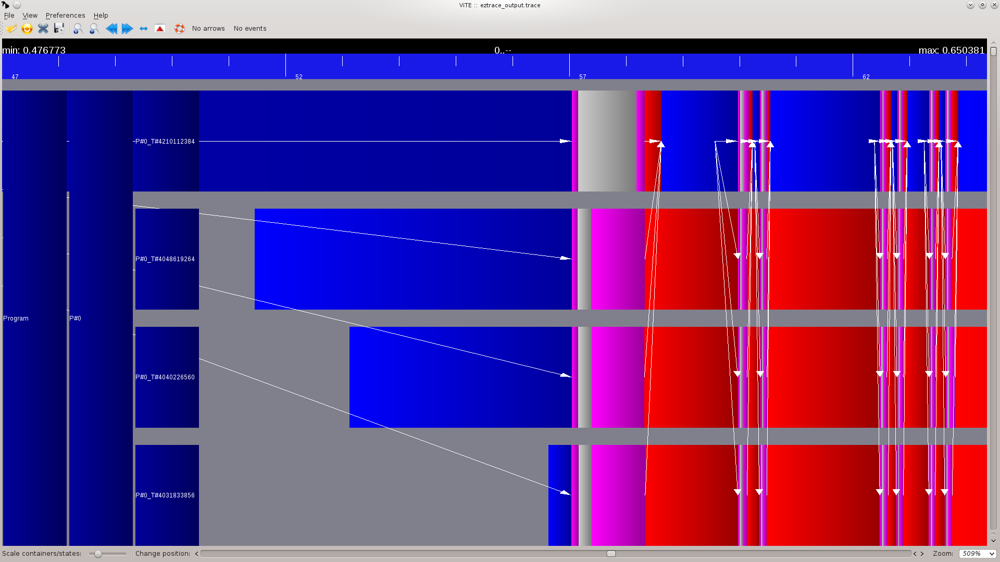

% HadoopTrace
% Rémy Zirnheld & Dan Nguyen

## HadoopTrace
Créer un plugin ezTrace pour Hadoop en Java 

{ width=35% }  +  { width=35% }

## HadoopTrace

## HadoopTrace

## HadoopTrace - Fonctionnement

## HadoopTrace - CheckList

* Appeler du C depuis Java
* Instrumenter une classe Java
* Passage de paramètres du Java vers le C
* Fonctionnement des Threads en Java
* Instrumentation d'interfaces Java - Hadoop MapReduce
* Générer des traces Hadoop
* Evaluer les peformances de l'instrumentation
