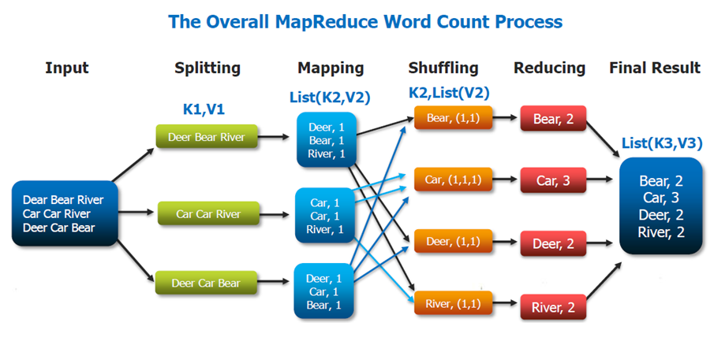
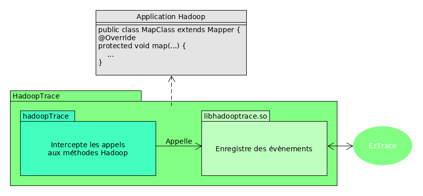
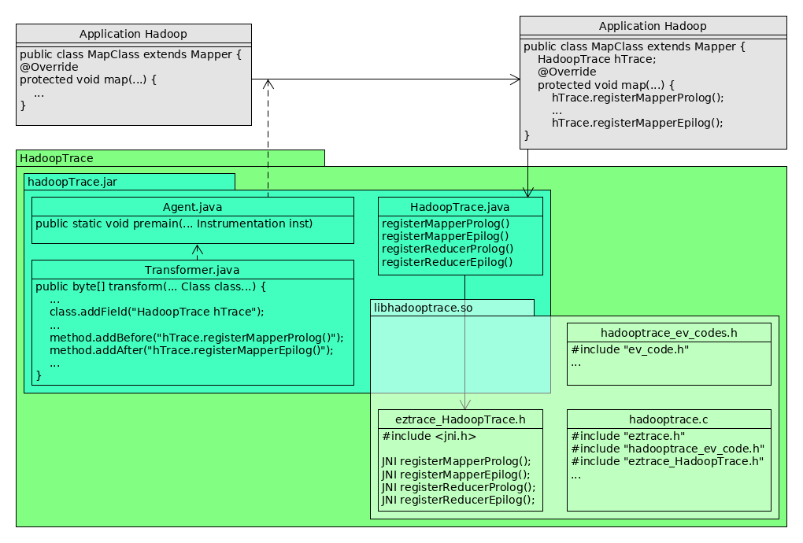
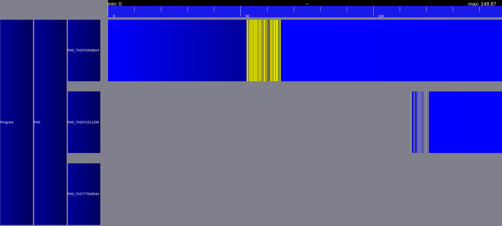

%HadoopTrace - Rapport de Projet de fin d'étude
%{ width=20% }
%**Rédigé par** : Dan Nguyen, Rémy Zirnheld, **Encadré par** : François Trahay

\newpage
## Introduction
Depuis les premiers pas d'Hadoop au début des années 2000, beaucoup de frameworks permettant de
faire du calcul distribué pour traiter des gros volumes de données ont vu le jour :
ElasticSearch, Storm ou plus récemment Spark. Aujourd'hui, peu d'outils existent pour profiler les
applications utilisant ces frameworks, la plupart de ces outils servant pour le calcul haute performance.

EzTrace est l'un de ces outils : écrit en C, il permet de profiler des applications elles aussi
écrites en C utilisant les frameworks classiques tels que OMP ou MPI, ou des plus récent comme CUDA.
Le projet HadoopTrace a justement pour objectif d'étendre les champs d'application d'ezTrace
pour permettre de profiler les applications utilisant le framework Hadoop qui lui est écrit en Java.
Nous nous interessons plus particulièrement au framework Hadoop MapReduce.

Le MapReduce est un paradigme de programmation permettant d'effectuer des traitements relativement
simples sur de gros volumes de données. Développé chez Google par Jeffrey Dean et Sanjay Ghemawat,
il simplifie grandement le passage à l'échelle ainsi que la gestion des fautes.

Le traitement de données utilisant le paradigme de programmation MapReduce est constitué de
différentes étapes, dont deux sont implémentées par l'utilisateur : Map et Reduce.
Voici les différentes fonctions sur l'exemple WordCount que l'on a implémenté :

{ width=90% }

* Splitting : Les données en entrée sont tout d'abord partitionnées pour être envoyées sur les noeuds du cluster :
  chaque noeud est ainsi responsable d'une partie des données

* **Map** : Cette fontion réalise le premier traitement effectué sur les données : il doit avoir pour sortie
  un ensemble de couples clé-valeur. Dans le cas d'un WordCount, les clés sont les mots et les valeurs associées
  sont le nombre d'occurences du mot dans la partition de données traitées par le noeud.

* Group by Key/Shuffling : Les données sont regroupées par clés. Tous les couples ayant une même clé sont envoyés
  sur le même noeud.

* **Reduce** : Cette fonction réalise le second traitement sur les données : il prend en entrée des ensembles de
  couples ayant la même clé, et dépend complètement de l'application. Dans le cas du WordCount, on additionne
  pour chaque clé toutes les valeurs des couples ayant cette même clé. On obtient ainsi l'occurence du mot dans tout
  le fichier d'entrée.

Ce paradigme de programmation peut être utilisé pour d'autres problèmes, tel que des tris ou d'autres problèmes
d'analyse de données.

Dans le cadre du projet, on souhaite analyser la répartition de charge entre les noeuds du cluster, et donc
repérer l'exécution des fonctions maps et reduces sur les différents noeuds.

\newpage
## I. Objectifs du projet
L'objectif général du projet est de contribuer au projet EzTrace, en ouvrant la voie sur
le profiling d'applications Java. Nous nous sommes donc fixé trois objectifs :

* Créer un module ezTrace pour Hadoop MapReduce
* Faciliter la création de modules ezTrace pour des applications Java
* Tester le module ezTrace pour limiter l'overhead induit par son utilisation

Pour cela, nous avons dû nous familiariser avec plusieurs technologies :

* Le fonctionnement du framework Hadoop MapReduce et d'HDFS (Hadoop Data File System)
* Java Native Interface (JNI), afin d'appeler des bibliothèques écrites en C depuis une application Java
* L'instrumentation en Java, avec l'utilisation de Javassist notamment
* La création d'un module ezTrace

\newpage
## II. Réalisation
Le logiciel à réaliser doit intercepter des appels à des méthodes Java puis appeler des fonctions d'une
bibliothèque partagée en C chargé d'enregistrer des évènements :

{ width=80% }

Afin de pouvoir realiser le plugin, nous avons d'abord chercher les bibliothèques et technologies à utiliser.
C'est pourquoi nous avons tout d'abord réalisé des mini-projets pour maîtriser JNI, l'instrumentation Java
et le framework Hadoop MapReduce. Nous avons ensuite fusionné ces mini-projets afin d'aboutir
à un prototype stable et fonctionnel du module ezTrace final.

### 1.Prise en main des outils
#### 1.1. JNI : Java Native Interface
JNI regroupe toutes les commandes et fichiers sources permettant d'exécuter du code écrit en C, dit natif,
à partir d'une application Java.

Afin de définir des fonctions natives, il suffit d'ajouter le mot clé `native` dans la déclaration de la fonction :
```Java
public class MyClass {
    public native void function();
    static {
        System.loadLibrary("mylib");
    }
}
```
En compilant le fichier `.java` à l'aide de l'option h, on obtient alors un fichier `header` à implémenter :
```C
/* DO NOT EDIT THIS FILE - it is machine generated */
#include <jni.h>
/* Header for class mypackage.MyClass */

#ifndef _Included_MyClass
#define _Included_MyClass
#ifdef __cplusplus
extern "C" {
#endif
/*
 * Class:     mypackage.MyClass
 * Method:    function
 * Signature: ()V
 */
JNIEXPORT void JNICALL Java_MyClass_function
        (JNIEnv *, jobject);

#ifdef __cplusplus
}
#endif
#endif
```
Il faut alors compiler le fichier source en tant que bibliothèque partagée. Cette dernière sera alors chargée
au même moment que la classe grâce au bloc static décrit dans MyClass.java.

Pour notre projet, nous nous somme servis de JNI pour implémenter les fonctions à exécuter avant et après les
appels des fonctions map et reduce, en utilisant les bibliothèques ezTrace.

#### 1.2. L'instrumentation Java avec Javassist
L'instrumentation en Java est native, c'est-à-dire qu'elle est déjà prévue par le langage : en effet il suffit
pour cela de créer ce qu'on appelle un agent. Un agent est tout simplement une classe qui contient la méthode
`static void premain(String, Instrumentation)`, méthode exécutée avant le main lorsque l'on précise l'option `javaagent`
à l'exécution d'une application Java.

Pour modifier le code à l'exécution, cet agent doit être accompagné d'un ou plusieurs objets de type
`java.lang.instrument.ClassFileTransformer`, qui spécifie le code à ajouter à l'exécution. Pour implémenter son
propre transformer, il suffit de surcharger la méthode `transform`, qui est executé pour chaque `.class`.
Cette méthode prend en entrée le nom de la classe et son byteCode notamment, et qui produit en sortie le nouveau byteCode
de cette classe. Afin de pouvoir modifier ce dernier facilement, nous avons utilisé Javassist. Cette bibliothèque
fournit un ensemble de classes et méthodes facilitant l'injection de byteCode.

Dans le cadre de notre projet, il suffit de créer un transformer qui ajoute des appels appropriés en C avant et
après chaque appel des fonctions map et reduce.

#### 1.3. Création d'un module ezTrace
Pour créer un module ezTrace, il suffit de créer trois fichiers :

* le fichier ev_code : ce fichier rassemble tous les codes des évènements que l'on veut enregistrer, soit deux par
  fonctions, l'entrée et sortie de la fonction. EzTrace fonctionne en effet avec des codes d'évènements sur 4 octets.
  Le premier est reservé au fonctionnement interne d'EzTrace, le second sert à identifier le/la framework/bibliothèque
  utilisé(e), et les deux derniers l'évènement.

* le fichier coeur, qui contient les évènements à enregistrer lors de l'appel des fonctions. L'interception des
  fonctions de la bibliothèque à profiler est faite en créant des fonctions qui ont le même prototype, et qui
  appellent les fonctions originales :

* le fichier permettant la conversion de la trace générée.

Pour le profilage du framework hadoop, la création du fichier coeur est nettement plus simple, puisque l'on n'a pas
à conserver le pointeur de fonction vers la fonction originale. Il suffit simplement d'enregistrer les évènements
qui nous intéressent.

### 2. Réalisation du module HadoopTrace
A ce stade, nous avions une idée bien plus précise du logiciel à programmer :

{ width=90% }

* __L'agent java__ : une classe agent qui instrumente les classes à l'aide d'une deuxième classe, transformer, et
  une troisième classe définissant les prototypes de fonctions à utiliser avec JNI. Notre transformer doit insérer
  l'instanciation d'un objet `HadoopTrace` (JNI) ainsi que l'appel des fonctions prolog et epilog, respectivement
  avant et après les méthodes map et reduce.
* __Le module ezTrace__ : ce module est composé de deux bibliothèques partagées ezTrace. La première implémentant les
fonctions définies via JNI et permettant d'enregistrer des évènements à l'exécution, la deuxième permettant de convertir
 les traces générées.

Nous avons actuellement réalisé un prototype de cet agent sous forme d'un module maven. Il contient tous les fichiers
sources ainsi que les deux fichiers compilés. Sur l'exemple du WordCount, cela nous a permis de générer des premières
traces :

{ width=90% }


\newpage

## III. Fin du projet et améliorations possibles
Il reste maintenant la phase de tests et d'optimisation de notre module ezTrace : en effet, l'utilisation d'ezTrace
doit impacter le moins possible sur les performances des applications Hadoop. Il est donc nécessaire d'effectuer
des mesures sur les temps d'exécution d'une même application avec et sans ezTrace.

Une continuation du projet serait donc de trouver des benshmark hadoop et de mesurer les temps d'execution avec et
sans module ezTrace, afin d'obtenir une idée de l'overhead induit par ezTrace sur hadoop.

### Améliorations possibles
Même en ayant un module ezTrace performant, nous pourrions avoir, au mieux, une trace d'éxecution de chaque noeud, et
non de l'application entière. De manière similaire à ce que fait ezTrace avec MPI, il reste à implémenter la partie
permettant de fusionner les traces des noeuds pour avoir une trace globale de l'execution d'applications. De plus,
il reste également à explorer le fonctionnement d'HDFS afin de savoir comment sont stocké les traces générées à
l'éxecution.