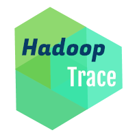

# HadoopTrace - Rapport de Projet de fin d'étude

Rédigé par : Dan Nguyen, Rémy Zirnheld

Encarant : François Trahay

{ width=20% }

## Introduction
Depuis les premiers pas d'Hadoop au début des années 2000, beaucoup de frameworks permettant de
faire du calcul distribué pour traiter des gros volumes de données ont vu le jour :
ElasticSearch, Storm ou plus récemment Spark. Aujourd'hui, peu d'outils existent pour profiler
les applications utilisant ces frameworks, la plupart de ces outils servant pour le calcul
haute performance.

EzTrace est l'un de ces outils : écrit en C, il permet de profiler des applications elle aussi
écrites en C utilisant les frameworks classiques tels que OMP ou MPI, ou plus récemment CUDA.
Le projet HadoopTrace a justement pour objectif d'étendre les champs d'application d'ezTrace
pour permettre de profiler les applications utilisant le framework Hadoop, lui écrit en Java.

## Objectifs du projet
L'objectif général du projet était de contribuer au projet EzTrace, en ouvrant la voie sur
le profiling d'applications Java. Nous nous sommes donc fixé trois objectifs :

- Créer un module ezTrace pour Hadoop MapReduce
- Faciliter la création de modules ezTrace pour des applications Java
- Tester le module ezTrace pour limiter l'overhead induit par son utilisation

Pour cela, nous avons du nous familiariser avec plusieurs technologies :

- Le fonctionnement du framework Hadoop MapReduce et d'HDFS (Hadoop Data File System)
- Java Native Interface (JNI), afin d'appeler des bibliothèques écrites en C depuis du Java
- L'instrumentation en Java, avec l'utilisation de Javassist notamment
- La création d'un module ezTrace

## Réalisation
### Prise en main des outils
- Hadoop MapReduce
- JNI
- Java Instrumentation
- ezTrace

### Réalisation du module HadoopTrace

## Analyse des performances
- Analyses sur la machine 32 coeurs

## Améliorations possibles
- Système permettant de merge les traces générées sur HDFS
- Plugin ezTrace pour faciliter la création de modules ezTrace pour des
  API Java